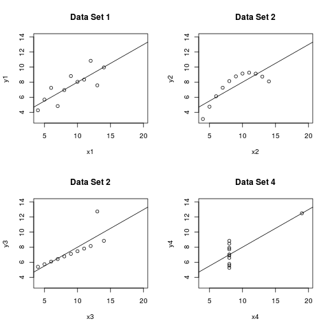

#### intubate <||> *Roberto Bertolusso*

##### *2016-07-26* - *2016-08-20* (GPL >= 2)


The aim of `intubate` (`<||>`) is to offer a painless way to
add R functions that that are not pipe-aware
to data science pipelines implemented by `magrittr` with the
operator `%>%`, without having to rely on workarounds. It also
offers two extensions (currently in experimental stage), called
`intubOrders`, and `intuBags`.

#### Installation

* the latest released version from CRAN (0.99.2) with

```{r}
install.packages("intubate")
```
(keep in mind you should use this version only for the interfaces, with
 a number of helper functions to define your interface. The
 newer version, 0.99.3, will need only one helper function, `intubate`, for all
 interfaces, and will also let you call the non-pipe-aware functions directly,
 *without* having to define an interface, by using the *new* function `ntbt`.)
 
* the latest development version from github with

```{r}
# install.packages("devtools")
devtools::install_github("rbertolusso/intubate")
```
### In a nutshell
If you like `magrittr` pipelines (%>%) and you are looking
for an alternative to perfoming a statistical analysis
in the following way:

```{r}
fit <- lm(sr ~ ., LifeCycleSavings)
summary(fit)
```

`intubate` let's you do it in these other ways:

```{r}
library(intubate)
library(magrittr)

## 1) Using interface (provided by intubate OR user defined)
LifeCycleSavings %>%
  ntbt_lm(sr ~ .) %>%    ## ntbt_lm is the interface
  summary()
  
## 2) Calling the non-pipe-aware function directly using ntbt
LifeCycleSavings %>%
  ntbt(lm, sr ~ .) %>%   ## ntbt calls lm without need to define interface
  summary()
```

`intubate` currently implements 454 interfaces (below you will find a list of packages
containing the interfaced functions) that can be related to data science
methodologies and other disciplines. For now the focus is on interfacing
non-pipe-aware functions having "formula" and "data" (in that order),
but the non-formula variants should also work (even cases currently lacking interfaces).

#### Interfaces "on demand"
`intubate` *also* let's
you **create your own interfaces** "on demand", **right now**, giving you
full power of decision regarding which functions to interface. It *also*
let's you **call the non-pipe-aware functions directly**, withou the need
of defining an interface.

The ability of being able to amplify the scope of `intubate`
may prove to be particularly welcome in case you are related to a particular
field that may, in the long run, continue to lack interfaces due to my
unforgivable, but unavoidable, ignorance.

As an example of creating an interface "on demand", suppose the interface to
`cor.test` was lacking in the current version of `intubate` and *suppose*
(only for a moment) that you want to
create yours because you are searching for a pipeline-aware alternative to
any of the following styles of coding (which, by the way, are perfectly fine
as they are and you shouldn't change yours if you like it and serves your purposes):

```{r}
data(USJudgeRatings)

## 1)
cor.test(USJudgeRatings$CONT, USJudgeRatings$INTG)

## 2)
attach(USJudgeRatings)
cor.test(CONT, INTG)
detach()

## 3)
with(USJudgeRatings, cor.test(CONT, INTG))
     
## 4)
USJudgeRatings %>%
   with(cor.test(CONT, INTG))
```
To be able to create an interface to `cor.test` "on demand", the *only* thing you
need to do is to add the following line of code somewhere before its use
in your pipeline:

```{r}
ntbt_cor.test <- intubate          ## intubate is the helper function

## Note the lack of parentheses
```

Nothing else is required.

The *only* thing you need to remember is that that the names of all interfaces
*must* start with `ntbt_` followed by the name of the *interfaced* function
(`cor.test` in this particular case), no matter which function you want to
interface.

Now you can use your "still hot" interface in any pipeline. A pipeline
alternative to the above code may look like this:

```{r}
USJudgeRatings %>%
  ntbt_cor.test(CONT, INTG)           ## Use it right away

USJudgeRatings %>%                    
  ntbt_cor.test(~ CONT + INTG)        ## Also the formula variant
```

#### Calling non-pipe-aware functions directly
Moreover, you **do not have to create an interface** if you do not
want to. You can **call the non-pipe-aware function directly** with `ntbt`,
in the following way:

```{r}
USJudgeRatings %>%
  ntbt(cor.test, CONT, INTG)           ## Use it right away

USJudgeRatings %>%                    
  ntbt(cor.test, ~ CONT + INTG)        ## Also the formula variant
```

You can potentially use `ntbt` with *any function*, also the ones without an interface
provided by `intubate`. In principle,
the functions you would like to call are the ones you cannot use directly in
a pipeline (because `data` is in second place instead of first).

#### Example showing different techniques

The link below is to Dr. Sheather's website where original data and code was extracted.
Note that it was downloaded around June 2015 (it may have been modified since then).
In the link there is also information about the book. 
This code could be used to produce Figure 3.1 on page 46, containing 4 plots.
Different strategies are illustrated.

http://www.stat.tamu.edu/~sheather/book/

```{r}
par(mfrow=c(2,2))           # Produce 4 panels to accommodate each plot.

## 1) As in the book (without using pipes and attaching data):
attach(anscombe)
plot(x1, y1, xlim = c(4, 20), ylim = c(3, 14), main = "Data Set 1")
abline(lsfit(x1, y1))
detach()

## You needed to attach so variables are visible locally.
## If not, you should have used anscombe$x1 and anscombe$y1.
## You could also have used 'with'.
## Spaces were added for clarity and better comparison with code below.

## 2) Alternative using magrittr pipes (%>%) and intubate (no need to attach):
anscombe %>%
  ntbt_plot(x2, y2, xlim = c(4, 20), ylim = c(3, 14), main = "Data Set 2") %>%
  ntbt(lsfit, x2, y2) %>%   # Call non-pipe-aware function directly with `ntbt`
  abline()                  # No need to interface 'abline'.
  
## * 'ntbt_plot' is the interface to 'plot' provided by intubate.
##   As 'plot' returns NULL, intubate forwards (invisibly) its input
##   automatically without having to use %T>%, so 'lsfit' gets the
##   original data (what it needs) and everything is done in one pipeline.
## * 'ntbt' let's you call the non-pipe-aware function 'lsfit' directly.
##   You can use 'ntbt' *always* (you do not need to use 'ntbt_' interfaces
##   if you do not want to), but 'ntbt' is particularly useful to interface
##   directly a non-pipe-aware function for which intubate does not provide
##   an interface.

## 3) Alternatively, if intubate does not provide an interface to a given
## function (as currently happens with lsfit), you can create your own
## interface "on demand" and use it right away in your pipeline.
## You only need to include the following line of code before its use:

ntbt_lsfit <- intubate      # NOTE: we are *not* including parentheses.

## That's it. Just remember that:
## 1) intubate interfaces *must* start with 'ntbt_' followed by the
##    name of the function to interface.
## 2) parentheses are *not* used in the definition of the interface.

## You can now use 'ntbt_lsfit' in your pipeline:
anscombe %>%
  ntbt_plot(x3, y3, xlim = c(4, 20), ylim = c(3, 14), main = "Data Set 2") %>%
  ntbt_lsfit(x3, y3) %>%    # Using just created "on demand" interface
  abline()

## 4) Alternatively, you can use the formula variant (original aim of intubate):
anscombe %>%
  ntbt_plot(y4 ~ x4, xlim = c(4, 20), ylim = c(3, 14), main = "Data Set 4") %>%
  ntbt_lm(y4 ~ x4) %>%      # We use 'ntbt_lm' instead of 'ntbt_lmfit' 
  abline()
```

This is the plot produced:
<div style="text-align:center"></div>


#### Interfaced libraries

The R packages that have interfaces implemented so far are:

* `adabag`: Multiclass AdaBoost.M1, SAMME and Bagging
* `AER`: Applied Econometrics with R
* `aod`: Analysis of Overdispersed Data
* `ape`: Analyses of Phylogenetics and Evolution
* `arm`: Data Analysis Using Regression and Multilevel/Hierarchical Models
* `betareg`: Beta Regression
* `brglm`: Bias reduction in binomial-response generalized linear models
* `caper`: Comparative Analyses of Phylogenetics and Evolution in R
* `car`: Companion to Applied Regression
* `caret`: Classification and Regression Training
* `coin`: Conditional Inference Procedures in a Permutation Test Framework
* `CORElearn`: Classification, Regression and Feature Evaluation
* `drc`: Analysis of Dose-Response Curves
* `e1071`: Support Vector Machines
* `earth`: Multivariate Adaptive Regression Splines
* `EnvStats`: Environmental Statistics, Including US EPA Guidance
* `fGarch`: Rmetrics - Autoregressive Conditional Heteroskedastic Modelling
* `flexmix`: Flexible Mixture Modeling
* `forecast`: Forecasting Functions for Time Series and Linear Models
* `gam`: Generalized Additive Models
* `gbm`: Generalized Boosted Regression Models
* `gee`: Generalized Estimation Equation Solver
* `glmnet`: Lasso and Elastic-Net Regularized Generalized Linear Models
* `glmx`: Generalized Linear Models Extended
* `gmnl`: Multinomial Logit Models with Random Parameters
* `gplots`: Various R Programming Tools for Plotting Data
* `gss`: General Smoothing Splines
* `graphics`: The R Graphics Package
* `hdm`: High-Dimensional Metrics
* `Hmisc`: Harrell Miscellaneous
* `ipred`: Improved Predictors
* `iRegression`: Regression Methods for Interval-Valued Variables
* `kernlab`: Kernel-Based Machine Learning Lab
* `kknn`: Weighted k-Nearest Neighbors
* `klaR`: Classification and Visualization
* `lars`: Least Angle Regression, Lasso and Forward Stagewise
* `lattice`: Trellis Graphics for R
* `latticeExtra`: Extra Graphical Utilities Based on Lattice
* `leaps`: Regression Subset Selection
* `lfe`: Linear Group Fixed Effects
* `lme4`: Linear Mixed-Effects Models using 'Eigen' and S4
* `lmtest`: Testing Linear Regression Models
* `MASS`: Robust Regression, Linear Discriminant Analysis, Ridge Regression,
          Probit Regression, ...
* `MCMCglmm`: MCMC Generalised Linear Mixed Models
* `mda`: Mixture and Flexible Discriminant Analysis
* `metafor`: Meta-Analysis Package for R
* `mgcv`: Mixed GAM Computation Vehicle with GCV/AIC/REML Smoothness Estimation
* `minpack.lm`: R Interface to the Levenberg-Marquardt Nonlinear Least-Squares
                Algorithm Found in MINPACK, Plus Support for Bounds
* `mhurdle`: Multiple Hurdle Tobit Models
* `mlogit`: Multinomial logit model
* `modeltools`: Tools and Classes for Statistical Models
* `nlme`: Linear and Nonlinear Mixed Effects Models
* `nlreg`: Higher Order Inference for Nonlinear Heteroscedastic Models
* `nnet`: Feed-Forward Neural Networks and Multinomial Log-Linear Models
* `ordinal`: Regression Models for Ordinal Data
* `party`: A Laboratory for Recursive Partytioning
* `partykit`: A Toolkit for Recursive Partytioning
* `plotrix`: Various Plotting Functions
* `pls`: Partial Least Squares and Principal Component Regression
* `pROC`: Display and Analyze ROC Curves
* `pscl`: Political Science Computational Laboratory, Stanford University
* `psychotree`: Recursive Partitioning Based on Psychometric Models
* `quantreg`: Quantile Regression
* `randomForest`: Random Forests for Classification and Regression
* `Rchoice`: Discrete Choice (Binary, Poisson and Ordered) Models with Random Parameters
* `rminer`: Data Mining Classification and Regression Methods 
* `rms`: Regression Modeling Strategies
* `robustbase`: Basic Robust Statistics
* `rpart`: Recursive Partitioning and Regression Trees
* `RRF`: Regularized Random Forest
* `RWeka`: R/Weka Interface
* `sampleSelection`: Sample Selection Models
* `sem`: Structural Equation Models
* `spBayes`: Univariate and Multivariate Spatial-temporal Modeling
* `stats`: The R Stats Package (glm, lm, loess, lqs, nls, ...)
* `strucchange`: Testing, Monitoring, and Dating Structural Changes
* `survey`: Analysis of Complex Survey Samples
* `survival`: Survival Analysis
* `SwarmSVM`: Ensemble Learning Algorithms Based on Support Vector Machines
* `systemfit`: Estimating Systems of Simultaneous Equations
* `tree`: Classification and Regression Trees
* `vcd`: Visualizing Categorical Data
* `vegan`: Community Ecology Package

The aim is to continue adding interfaces to most methodologies
  used in data science or other disciplines.
  
`intubate` core depends only on `base`, `stats`, and `utils` libraries.
To keep it as lean as
possible, and to be able to continue to include more interfaces without bloating your machine, 
starting from version 0.99.3 `intubate` **will not** install the packages
that contain the functions that are interfaced. *You will need to install them yourself*,
and load the corresponding libraries before using them in your pipelines. This
also applies to `magrittr` (in case you want to use `intubate` without pipelines).

Then, if you are only interested in a given field, say:
bio-statistics,
bio-informatics,
environmetrics,
econometrics,
finance,
machine learning,
meta-analysis,
pharmacokinetics,
phylogenetics,
psychometrics,
social sciences,
surveys,
survival analysis,
..., you will not have to install *all* the packages for which interfaces are provided
if you intend to use only a subset of them. You only need to install
the subset of packages you intend to use (which are probably already installed in your machine).

Also, there are cases where some packages are in conflict if loaded simultaneously, leading
to a segmentation fault (for example, kernlab functions fail when testing the whole
examples provided with `intubate`, but not when testing kernlab only examples
in a clean environment. I ignore which is/are the other(s) package(s) conflicting with it.
The only thing I know is that the package name is alphabetically ordered prior to kernlab)

I make no personal judgement (mostly due to personal ignorance)
about the merit of any interfaced function.
I have used only a subset of what is provided, and I am happy to include others,
that I am currently unaware of, down the line. In principle I plan on including
packages that are listed as reverse depends, imports, or suggest on package `Formula`
(I am missing still quite a bit of them). Adding interfacings is easy (and can be
boring...) so I will appreciate if you want to contribute (and you will be credited
in the help of the interfaced package). Also is welcome the improvement of the
provided examples (such as making sure the data used is correct for the statistical
technique used).

I do not claim to be a data scientist (I still have almost no clue of what a data scientist
is or is not, and my confusion about the subject only increases with time),
nor someone entitled to tell you what to use or not.

As such, I am not capable of engaging in disputes of what is relevant or not, or,
if there are competing packages, which to use.
I will leave that to you to decide.

Please keep in mind that `intubate`
will **not** install any packages correponding to the interfaces
that are provided. You can install *only* those that you need
(or like) and disregard the rest. Also please remember that you can create your
own interfaces (using helper function `intubate`),
or call non-pipe-aware functions directly (using `ntbt`).

The original aim of `intubate` was to be able to include functions that
have *formula* and *data* (in that order) in a `magrittr` pipeline using `%>%`.
As such, my search so far has been concentrated in packages containing formulas and
misplaced (from pipes point of view) data.

For example, this was my first implementation of `ntbt_lm`
```{r}
ntbt_lm <- function(data, formula, ...)
  lm(formula, data, ...)
```

This was supposed to be repeated for each interface.

Soon after I realized that `intubate` could have a few helper functions (that was
version 0.99.2), later that only one helper function was needed (`intubate`), and
later that you could call non-pipe-aware functions directly without defining
interfaces (`ntbt`) and
that the interfaces and `ntbt` could also be successfully used in cases
where non-formula variants are implemented.

However, my starting point inevitably led the way. I did not *see* the big picture
(well, what *today* I *think* the big picture is...),
so the current version only addresses packages containing functions that use formula
variant, even
if in those cases you can also use the non-formula variants (you can see the
examples corresponding to `pROC`, where both cases for formula and non-formula
are demonstrated. You should be able to use that technique also for the rest of
the packages).

I am brewing some ideas about a general approach to packages that
do not use formula interface, but I leave that for a future iteration of `intubate`.

This means that there are two possibilities to the eventual
lack of inclusion of your favorite package for the time being:

1. The package only uses matrices or x- y- like notation (and not formulas)
2. (more likely reason) I should know better, but I missed it
(truth is that by implementing the supplied interfaces I realized how little
I knew, and still know, about a field in which I am supposed to be an expert),
and I apologize for that.
3. I got to the point I need to take a rest (this reason is competing with 2.
with increasing strength as time passes by. If something looks odd,
you can refer to the Spanish Inquisition by Monty Python)

Also, please keep in mind you have a very good chance you can create your own interfaces
(with the helper function `intubate`), or call the non-pipe-aware functions
directly (with `ntbt`).

#### Experimental features, not for general or production use
`intubate` includes two experimental features: **intubOrders**, and **intuBags**.

These experimental features are already in place but are still under development, are
**not considered for general use**, and are not documented (yet).
 I want to make sure first, to the best of my abilities, that
they are as general as possible, and that eventual future extensions will be backward
compatible. You can play with them if you like (I need to play with them more...),
but if you use them in production code
be prepared to have to change it if I decide to modify the architecture while in the
experimental phase.

* **intubOrders** allow to forward the input without using %T>%, and to run `print`,
`summary`, `anova`, `plot`, and such, in place. This may prove to be interesting to non-pipeline
oriented people too. intubOrders are also needed by `intuBags`. If you want to have an
idea of what I mean, please run (using the last version committed to github):

```{r}
## Note: this is *only* to demonstrate what you *can* do with intubOrders,
##       not a suggestion of what you *should* do with them.

## 1) Using interface
LifeCycleSavings %>%
  ntbt_lm(sr ~ pop15 + pop75 + dpi + ddpi,
          "< head(#, n=10); tail(#, n=3); str; dim; summary; View
             |f|
             print; summary; anova; plot(#, which=1); plot(#, which=2);
             par(mfrow=c(2,2)); plot(#, which=3:6) >") %>%
  head()

## 2) Calling function directly
LifeCycleSavings %>%
  ntbt(lm, sr ~ pop15 + pop75 + dpi + ddpi,
       "< head(#, n=10); tail(#, n=3); str; dim; summary; View
         |f|
         print; summary; anova; plot(#, which=1); plot(#, which=2);
         par(mfrow=c(2,2)); plot(#, which=3:6) >") %>%
  head()
```

Below there is a more involved case, transforming the code in

https://cran.r-project.org/web/packages/survey/vignettes/survey.pdf

```{r}
library(survey)
data(api)

## First, the original code from the vignette
vars<-names(apiclus1)[c(12:13,16:23,27:37)] 

dclus1 <- svydesign(id = ~dnum, weights = ~pw, data = apiclus1, fpc = ~fpc)
summary(dclus1)
svymean(~api00, dclus1)
svyquantile(~api00, dclus1, quantile=c(0.25,0.5,0.75), ci=TRUE)
svytotal(~stype, dclus1)
svytotal(~enroll, dclus1)
svyratio(~api.stu,~enroll, dclus1)
svyratio(~api.stu, ~enroll, design=subset(dclus1, stype=="H"))
svymean(make.formula(vars),dclus1,na.rm=TRUE)
svyby(~ell+meals, ~stype, design=dclus1, svymean)
regmodel <- svyglm(api00~ell+meals,design=dclus1)
logitmodel <- svyglm(I(sch.wide=="Yes")~ell+meals, design=dclus1, family=quasibinomial()) 
summary(regmodel)
summary(logitmodel)

## Now using intubOrders. I will use ntbt. Alternatively,
## the interfaces could be defined and used.

## Strategy 1: long pipeline, light use of intubOrders.
apiclus1 %>%
  ntbt(svydesign, id = ~dnum, weights = ~ pw, fpc = ~ fpc, "<|C| summary >") %>%
  ntbt(svymean, ~ api00, "<|Cf| print >") %>%
  ntbt(svyquantile, ~ api00, quantile = c(0.25,0.5,0.75), ci = TRUE, "<|Cf| print >") %>%
  ntbt(svytotal, ~ stype, "<|Cf| print >") %>%
  ntbt(svytotal, ~ enroll, "<|Cf| print >") %>%
  ntbt(svyratio, ~ api.stu, ~ enroll, "<|Cf| print >") %>%
  ntbt(svyratio, ~ api.stu, ~ enroll, design=subset("#", stype=="H"), "<|Cf| print >") %>%
  ntbt(svymean, make.formula(vars), na.rm = TRUE, "<|Cf| print >") %>%
  ntbt(svyby, ~ ell + meals, ~ stype, svymean, "<|Cf| print >") %>%
  ntbt(svyglm, api00 ~ ell + meals, "<|Cf| summary >") %>%
  ntbt(svyglm, I(sch.wide=="Yes") ~ ell + meals, family = quasibinomial(), "<|Cf| summary >") %>%
  summary() ## We have forwarded the result from svydesign (line 2),
            ## so we could still continue using it downstream.

## Strategy 2: short pipeline, heavy use of *one* intubOrder.
apiclus1 %>%
  ntbt(svydesign, id = ~dnum, weights = ~pw, fpc = ~fpc,
       "<|Cf|
         summary;
         svymean(~api00, #);
         svyquantile(~api00, #, quantile = c(0.25, 0.5, 0.75), ci = TRUE);
         svytotal(~stype, #);
         svytotal(~enroll, #);
         svyratio(~api.stu,~enroll, #);
         svyratio(~api.stu, ~enroll, design = subset(#, stype == 'H'));
         svymean(make.formula(vars), #, na.rm = TRUE);
         svyby(~ell+meals, ~stype, #, svymean);
         summary(svyglm(api00~ell+meals, #));
         summary(svyglm(I(sch.wide == 'Yes')~ell+meals, #, family = quasibinomial())) >") %>%
  head()  ## We have forwarded the original dataset,
          ## so we could continue using it downstream.
```

`intubOrders` are under heavy development, so this is just an idea that is searching
for a final form.

* **intuBags** allow to run *one* pipeline containing *several* sources. intuBags can be
dynamically populated by result(s?) at each step of the pipeline. Results can be, for example, modifications of an original source that can be replaced by the modification or saved as new object. They can also be from a statistical procedure, such as `lm`, or other things.
Each step of the pipeline can choose which source(s?) to use, and has the choice to add its
result(s?) to the intuBag, and these added or modified results can be used downstream,
or once the pipeline is ended. If you save the end result, you will have a single object
containing all the sources, their modifications (or replacements of sources by their
modifications), and results of processing sources by the different steps (if you
wanted to save them). You can also stop the pipeline at any point (saving your iBag
perhaps with a %<>%), do something else, and then restarting your pipeline from the
point you stopped. 
This means you could potentially have one object only, the intuBag, containing all the
objects (sources and products). One possible use of intuBags could be to process a *whole database* (several tables, data.frames, or tibbles) in *one* pipeline. I am not sure yet,
but maybe it is a good idea to intubate pipe-aware functions too (I have played with
intubating `subset`). Maybe not. Of course  pipe-aware functions can always get the
whole intuBag at any point of the pipeline, do their magic without being intubated,
and then let the pipe continue.

This means `intubate` will have three modes of operations:

* as interface only,
* as interface + intubOrders, and
* as interface + intubOrders + intuBags.

#### Bugs and Feature requests
The robustness and generality of the interfacing machinery still needs to be
further *verified* (and very likely improved),
as there are thousands of potential functions to interface and
certainly some are bound to fail when interfaced. Some have already been addressed
when implementing provided interfaces (as their examples failed).

The goal is to make `intubate` each time more robust by
addressing the peculiarities of newly discovered failing functions.

For the time being, only cases where the
*interfaces provided with* `intubate` *fail* will be considered as *bugs*.

Cases of failing *user defined interfaces* or when using `ntbt` to call functions
directly that do not have interfaces provided with released versions of `intubate`,
will be considered *feature requests*.

Of course, it will be greatly appreciated,
if you have some coding skills and can follow the code of the interface,
if you could provide the proposed *solution*, that *shouldn't break anything else*,
together with the feature request.

#### Logo of `intubate`
The logo of `intubate` is: **`<||>`**. It corresponds to an **intuBorder**. I have not
found it in a Google search as of 2016/08/08. I intend to use it as a visual
identification of `intubate`. If you know of it having being in use before this date
in any software related project, please let me know, and I will change it.

#### Names used
*intuBorder(s)* and *intubOrder(s)*, as of 2016/08/08, only has been found, on Google,
in a snippet of code for the name of a variable (`intUBorder`) (http://www.office-loesung.de/ftopic246897_0_0_asc.php) that would mean something
like an "integer upper border". There is also an `intLBorder` for the lower border.

*intuBag(s)*, as of 2016/08/08, seems to be used for a small bag for bikes (InTuBag,
meaning Inner Tub Bag)
(https://felvarrom.com/products/intubag-bike-tube-bag-medium-blue-inside?variant=18439367751),
but not for anything software related. If `intubate` succeeds, they may end selling
more InTuBags!

*intubate*, as of 2016/08/08, seems to be used related to the medical procedure, perhaps
also by the oil pipeline industry (at least "entubar" in Spanish is more general than the
medical procedure), but not for software related projects.

*intuEnv*, as of 2016/08/18, was found only in some latin text.

I intend to use "intubate", "<||>", "intuBorder", "intubOrder(s)", "intuBag(s)",
"intuEnv(s)"and other derivations starting with "intu", in relation to the use
and promotion of "intubate" for software related activities.

Down the line I intend to register the names and logo as trademarks.

#### See also

* The [*setter*](https://bitbucket.org/richierocks/setter)
package contains mutators to set attributes of variables,
that work well in a pipe (much like `stats::setNames())`.

* The [*srvyr*](http://www.github.com/gergness/srvyr) package allows
for analysis of complex surveys using the pipe-friendly syntax of dplyr.

### Entries by date
At this point you may have an idea if `intubate` is or not for you. If you elect
to continue reading, please be warned that my style or writing may or may not be
of your liking. Most of what follows is for my personal amusement.

#### 2016/08/05
* Core of the interface function (now called `intubate`) should be finished.
Please torture test with as many cases as possible to see how robust it is.
I will be out for the rest of the week.

(I want to point out that I have delivered on my promise made on 2016/08/03 to
 further reduce the labor involved while defining interfaces. I am happy to
 report that using `intubate` instead of `ntbt_function_data` represents a
 55.55% reduction of the amount of typing required, which will significantly
 increase the production of interfaces per minute. I am pleased with the
 results and consider this a huge success! Congratulations to Everybody!)

Please know that there is much more to come about which I will not comment for now, but that should potentially make `intubate` useful *even* if you
do not want to use it in pipelines (remember that you should not be forced to
use pipelines if you like other alternatives better). It should also take
pipelines to a different dimension, in case you like them.

#### The Evil Plan
What I will (in fact, have to) publicly inform is that `intubate` features an
*Undisclosed Evil Plan of World Domination* that will be unveiled in the time to come
according to my Organization's *Evil Master Plan*.

Please also be notified that we are thinking about achieving our goals
in three stages (aka *The Stages*):

1. Set foundations needed for the ones to come later. This
   will be already *World Domination* but nobody will notice it.
2. Using *Deception*, lay *The Bait* to attract you to *The Trap*.
3. Convert you into our slave, without you being able to do anything
   about it.

##### Appendix: Legal aspects related to Evil Plans
If you find yourself at loss regarding the legality of the above and/or wonder why
I am disclosing this information, please know that
*someone* (I *cannot* tell the name but *trust me* that he/she is *very well
connected* and knows *everything* about *these things*), informed me recently that:
"to have an *Undisclosed Evil Plan of World Domination*" is OK (well... he/she really
said "is acceptable") "as long as you disclose *that you have one* and clearly
specify *The Stages*", which can be non-specific but need to include wording that
"warns about the existence of *The Bait*, *The Trap*, *Deception* and *Coercion* in case
any or all of these *standard resources* are planned to be utilized at some point".

The rationale is that "even if the
*Regulatory Agencies* share the public's
concern and are fully aware of the common misconception according to which they
should protect, to *the full extent of their abilities*, the unaware citizen from being abused,
full disclosure of *The Evil Plan* could prove unacceptably counterproductive to the
successful fulfillment of *World Domination* by an *Evil Organization* that, we cannot
forget, *also pays taxes* and thus is entitled to *some level of protection* to conduct
its business in a *satisfactory way*".

This solution,
albeit non perfect, is considered "a fair compromise that protects, to some degree, the
rights of everybody involved".

You have been served!

Have fun (while you can...)

#### 2016/08/03

* Now all interfaces derive from only *one* helper function called,
  for now, `ntbt_function_data`.

```{r}
### Create some non implemented interfaces
ntbt_legend <- ntbt_cat <-
  ntbt_function_data  ## One helper function only to create interfaces
```
  
  (Two steps to create an interface seemed excessive,
   too much, no-way dude,
   especially with one of them requiring a rational decision.
   You need one step only now, so you can create your interfaces
   when you drink your coffee and text while driving to work.
   
   This will be particularly appreciated down the line, when the
   technology of self-driving cars is definitely polished and
   established, and you will be forced to work while commuting
   to work after working at home...
   I mean you will have even more free time available to relax and enjoy.
   
   Anyway, I am still not satisfied with the amount of labor required on
   the user's side and will put my best effort in trying to further reduce it.)

* In addition to formula versions:

```{r}
library(magrittr)
library(intubate)

USJudgeRatings %>%
  ntbt_cor.test(~ CONT + INTG)
```

you can also use, for example, the `x` `y` versions:

```{r}
USJudgeRatings %>%
  ntbt_cor.test(CONT, INTG)
```

All the examples in the documentation run (but they
are formula-only versions). Tests to see if this
works as expected are welcome.

Of course it would be pure
magic if it just simply works no matter what you throw at
it, and I simply have no clue of all the possible behaviors
of the interfaced functions.

My goal is that it works reasonably in cases you would
*normally* use in data science pipelines.

I anticipate *limitations*. I will try to address the ones
that can be solved in a general and easy way and that
*really* represent a need, because the helper function
machinery has to stay powerful yet simple.

* If interfaced function returns NULL, the interface function
  forwards invisibly the input, so you can use the data downstream.
  
```{r}
library(dplyr)
CO2 %>%
  mutate(color=sample(c("green", "red", "blue"),
                      length(conc), replace = TRUE))%>%
  ntbt_plot(conc, uptake, col = color) %>%  ## plot returns NULL
  ntbt_lm(conc ~ uptake) %>%  ## data passes through ntbt_plot
  summary()

within(warpbreaks, {
  time <- seq_along(breaks)
  W.T <- wool:tension
}) %>%
  ntbt_plot(breaks ~ time, type = "b") %>%
  ntbt_text(breaks ~ time, label = W.T,
            col = 1 + as.integer(wool)) %>%
  ntbt_cat("And now we write a legend.") %>%
  ntbt_legend("top",
              legend = levels(wool),
              col = 1 + as.integer(wool)) %>%
  invisible()
```

* You can also do things like

```{r}
ntbt_cat <- ntbt_print <- ntbt_View <-
  ntbt_function_data

CO2 %>%
  ntbt_cat("The first row has uptake -", uptake[1],
           "- and concentration", conc[1],"\n") %>%
  ntbt_cat("The mean uptake is -", mean(uptake),
           "- with standard deviation", sd(uptake),"\n") %>%
  ntbt_cat("uptake observations", uptake, sep="\n") %>%
  ntbt_print() %>%
  ntbt_View() %>%
  ntbt_lm(conc ~ .) %>%
  summary()
```

#### 2016/07/30

### Pipelines
Pipelines in R are made possible by the package `magrittr`,
by Stefan Milton Bache and Hadley Wickham.

`dplyr`, by Hadley Wickham, Romain Francois, and RStudio,
is used here to illustrate data transformation.
```{r}
## Packages needed
library(dplyr)     ## Does data transformation
library(magrittr)  ## Implements pipelines

## Data used
# devtools::install_github("hadley/yrbss")
library(yrbss)
data(survey)
```

This *machinery* allows to perform data transformations
using pipelines in the following way:
```{r}
survey %>%
  group_by(year) %>%
  summarise(count = n(),
            countNA = sum(is.na(stheight)),
            propNA = mean(is.na(stheight))) %>%
  knitr::kable()
```

Pipelines seem to be the preferred way, these days, of doing data
transformation. If you want an introduction about pipelines,
and/or to learn more about them, please follow this link (http://r4ds.had.co.nz/transform.html)
to the chapter on data transformation of the
forthcoming book "R for Data Science" by
Garrett Grolemund and Hadley Wickham.

### R statistical functions and pipelines
Suppose you want to perform a regression analysis
of the weight on height of males corresponding
to the year 2013 (assuming
for the sake of argument that it is a valid analysis
to perform. See at the very end of the document
for more on this).

As most R functions are not pipeline-aware, you
should do something like the following.

First, you perform your data science transformations
and save the result to a temporary object (`tmp` in this case).
```{r}
survey %>%
  filter(!is.na(stheight) & !is.na(stweight) &
           year == 2013 & sex == "Male"
  ) %>%
  select(stheight, stweight) ->
tmp
```

Then, you perform your regression analysis on the transformed
data stored in `tmp`.
```{r}
fit <- lm(stweight ~ stheight, tmp)
summary(fit)
```

(There is nothing wrong in this approach. In fact it is good. Jolly good. Splendid!
If you are absolutely happy with doing things this way then there is no need
to continue to devote your efforts in reading this document.
`intubate` is not for you. I am happy we could establish this in such little time.)

But what if, in addition to the data transformation, you
would also like to perform your data modeling/analysis under the
same pipeline paradigm (by adding lm to it),
which would impart notation consistency and
would avoid the need of creating the temporary object?
```{r, eval=FALSE}
survey %>%
  filter(!is.na(stheight) & !is.na(stweight) &
           year == 2013 & sex == "Male"
  ) %>%
  select(stheight, stweight) %>%
  lm(stweight ~ stheight) %>%  ## Using the original function
  summary()
```

You get an **error**.

The reason of this failure is that pipeline-aware functions (such as the ones
in `dplyr` that were specifically designed to work in pipelines) receive the data as
the **first** parameter, and most
statistical procedures that work with **formulas** to specify the **model**,
such as `lm` and lots of other rock solid reliable functions that implement
well established  statistical procedures, receive the data as the **second**
parameter.

This *minor* detail can make a difference, actually a huge one.
In fact, it may create a division line of two clearly separated cultures, that I will call, for the lack of better names, the "traditionalists" and the "modernists".

(They could be the "modeldatas" and the "datamodels".
Whichever you prefer that does not offend anyone)
 
The aim of `intubate` is to provide an easy alternative so nobody has to change the way they do things.

If you are a "traditionalist" and you want to create your new 
statistical package in the traditional way
(first `model` and then `data`), you will not potentially find yourself at a crossroad if you think you need to decide which community to serve, when in fact you can serve *both* communities without having to do anything differently to what you have done so far. You can just keep doing it in the traditional way. In fact, (please...) keep doing it in the traditional way!

Why? Because *Everybody* will benefit.

     EXT. BUCOLIC PASTURE - EARLY MORNING
     
     Background music initially inaudible slowly increases in
     volume while the panning camera, starting from a small
     and fragile flower, reveals legions of smiling people
     holding hands. Half dress t-shirts with a capital T, the
     other half with a capital M.
     Everybody raises their arms to the sky - still holding hands -
     as if trying to embrace the universe.
     Camera slowly raises, zooming out and tilting down, making
     sure Everybody is included in the frame, while Everybody
     mantains eye contact with the camera.
     Sun rays break through heavy pure snow-white clouds.
     Everybody opens their mouth and slowly inhales while closing
     their eyes as if they really mean what comes next.
     (This is critical. Make sure it looks credible.)
     Music at full volume.
     Everybody sing.
                            Everybody
         We aaaaare the Woooorld - ta ta ta ta taaaa...
         We aaaare the chiildreeeen - ta ta ta ta taaaa...

For "traditionalist" users (as I was until a couple of months ago), nothing will have
changed. In fact, they will be completely unaware of anything different happening at all.
Just business as usual and another fantastic statistical procedure to add to their bag of
resources.

For "modernist" users, `intubate` will do a couple of tricks behind the scenes so
they will be able to run, right at the end of any required data transformation,
your statistical procedures without any hassle using their preferred paradigm of pipelines.

There are alternatives that allow
to include `lm` (and others) in the pipeline without errors and without `intubate`.
They require workarounds
of varying levels of complexity and are illustrated later.

If you choose `intubate` is because you do not want to bother about workarounds when working with pipelines that include statistical procedures.

## intubate
The solution `intubate` proposes is to provide an *interface* to `lm`,
called `ntbt_lm`, that can be used *directly in the pipeline without error* and
without losing any of `lm`'s capabilities.
```{r}
library(intubate)
survey %>%
  filter(!is.na(stheight) & !is.na(stweight) &
           year == 2013 & sex == "Male"
         ) %>%
  select(stheight, stweight) %>%
  ntbt_lm(stweight ~ stheight) %>%  ## Using the interface function
  summary()
```

 By using
the interface the error vanishes, as the interface receives `data`
as its first parameter and `formula` second, performs some function transformations, and then calls
`lm` in the way it expects to receive the parameters (`formula` in first place,
and `data` in second place). Now `lm` can
continue to do all the good things we are used to.

(It is as if `lm` couldn't take anymore being accused by some
 of looking old. So it went to the beauty parlor, had a hair
 cut, and suddently looks "modern" and now is popular again.)

All the interfaces start with `ntbt_` followed by the name of the *interfaced* function.

Just in case, worry not! The *interfaces* do not perform any statistical computations
(you should be very suspicious if they would). The *interfaced* functions
(those that are already well tested, or should be) are the ones performing the computations.

### Interfaces "on demand"

(It used to be "on the fly", but "on demand" sounds more marketable. Right?)

What if you would like to have an interface to a non pipeline-aware function
that is not currently implemented by `intubate`?

In a vast majority of cases of R functions (I would like to say all
but I still do not know), you can create your own interface "on demand".

To help you in the process, `intubate` exposes one helper function,
called `intubate`, to assist you.

(Well... *something* had to do this lazy package...)

### Steps to create interfaces "on demand"
For the sake of argument, suppose `ntbt_lm` (the interface to `lm`)
is not implemented by `intubate`, and
you want to create an interface for it.

All you need is adding the following **one line** of code
  somewhere **before** the code that uses it:
```{r,message=TRUE}
ntbt_lm <- intubate
```
Hard?

(You see, it is not enough that `intubate` is a lazy package. It also
 promotes laziness).

Is it confusing?

No?

Really?

OK, let's see how you do in a quiz, under the Honor Code.


            Name:
            Honor Code Statement:
            
            Question: Which helper function would you use to construct
            your interface for the function `t.test`? [5]
            How should you name your interface? [5]

(Psst!... here... don't look!... I told you not to look!... yes, yes, play dumb... you don't have to worry... someone told me there
is a solution manual somewhere in the net...)

Remember: names of interfaces must start with
       `ntbt_` followed by the name of the function
       (`lm` in this case) you want to interface.

You can now use the interface function in any context
in which you would use the original function.
If you do not want to name the parameters, just remember to **switch**
the order of `formula` and `data` arguments when using the interface
(first `data` argument and then `formula` argument).
As usual, you can put them in any order if you name the arguments 
(actually, there are cases in which this is not true. More on this
later)
```{r}
fit <- ntbt_lm(tmp, stweight ~ stheight)
summary(fit)
```

Of course you should want to use the interface in a pipeline context.
Otherwise, `intubate` is virtually worthless.
```{r}
tmp %>%
  ntbt_lm(stweight ~ stheight) %>%
  summary()
```

Adding interfaces to the `intubate` package also represent one-liners for me.

(Did you think I would work more than you?)

The time consuming part on my side is to prepare
the documentation, that certainly needs improvement, and make sure
the examples work.

## Discussion
#### Disclaimer:
*I have a vested interest in making* `intubate` *a success
             for egotistical purposes. As such, I may
             be overstating the strengths and understating the
             weaknesses (weaknesses?? which weaknesses??) of* `intubate`.
             *More than a discussion, this can be easily considered
             like a sales pitch for a product of dubious quality.*
             
             You have been warned. Continue at your own risk.

### What can you do if you do not want to use `intubate` and you still want to use these kind of functions in pipelines?

#### Example 1:
`lm` can still be added directly to the pipeline,
without error, by specifying the name of the parameter
associated with the model (`formula` in this case).
```{r}
tmp %>%
  lm(formula = stweight ~ stheight)
```

(So what is the big fuss about `intubate`?)

The drawback of this approach is that not all functions
use `formula` to specify the model.

So far I have encountered 5 variants:

* `formula`
* `x`
* `object`
* `model`, and
* `fixed`

This means you will have to know and remember
(yes, also some months from now) which name has been
assigned to the model by **each**
particular function.

(OK, OK, you don't need to remember. You
can go back to the documentation... over and over again!)


In fact, the following are examples of functions using the other variants.

#### Example 2:
Using `xyplot` directly in a data pipeline will raise an error
```{r, eval=FALSE}
library(lattice)
iris %>%
  xyplot(Sepal.Length + Sepal.Width ~ Petal.Length + Petal.Width | Species,
         scales = "free", layout = c(2, 2),
         auto.key = list(x = .6, y = .7, corner = c(0, 0)))
```

unless `x` is specified.
```{r}
iris %>%
  xyplot(x = Sepal.Length + Sepal.Width ~ Petal.Length + Petal.Width | Species,
         scales = "free", layout = c(2, 2),
         auto.key = list(x = .6, y = .7, corner = c(0, 0)))
```

#### Example 3: 
Using `tmd` (a *different* function in the *same* package)
directly in a data pipeline will raise an error
```{r, eval=FALSE}
library(lattice)
iris %>%
  tmd(Sepal.Length + Sepal.Width ~ Petal.Length + Petal.Width | Species,
      scales = "free", layout = c(2, 2),
      auto.key = list(x = .6, y = .7, corner = c(0, 0)))
```

unless `object` is specified.
```{r}
iris %>%
  tmd(object = Sepal.Length + Sepal.Width ~ Petal.Length + Petal.Width | Species,
      scales = "free", layout = c(2, 2),
      auto.key = list(x = .6, y = .7, corner = c(0, 0)))
```


#### Example 4:
Using `gls` directly in a data pipeline
            will raise an error
```{r, eval=FALSE}
library(nlme)
Ovary %>%
  gls(follicles ~ sin(2*pi*Time) + cos(2*pi*Time),
      correlation = corAR1(form = ~ 1 | Mare))
```

unless `model` is specified.
```{r}
Ovary %>%
  gls(model = follicles ~ sin(2*pi*Time) + cos(2*pi*Time),
      correlation = corAR1(form = ~ 1 | Mare))
```


#### Example 5:
Using `lme` directly in a data pipeline
            will raise an error
```{r, eval=FALSE}
library(nlme)
try(Orthodont %>%
      lme(distance ~ age))
geterrmessage()
```

unless `fixed`(!) is specified.
```{r}
Orthodont %>%
  lme(fixed = distance ~ age)
```

##### (Subliminal message 1:
*there may be many much more different variants - possibly thousands -
lurking around in the darkness. They may hunt you and hurt you... badly...
`intubate` will keep you warm and safe, in a happy place where
everybody loves you and nothing wrong can happen to you.*)

 I find that having to remember the name of the
 parameter associated to the model in each case
 is unfortunate, error prone, and gives an
 inconsistent look and feel to an otherwise elegant
 interface.
 
 Moreover, it is consider good practice 
 in R to not specify the name of the first two parameters, and
 name the remaining.
 
 (Note the lack of citation to such categorical
 statement... ughh, sheer desperation).
 
 Not having to specify the name of the
 model argument completely hides the heterogeneity of names
 that can be associated with it. You only write the model
 and completely forget which name has been assigned to it.

##### (Subliminal message 2:

- *not using `intubate` => uncool*,
- *using `intubate` => extremely cool*)

### Other nightmares around the corner
 If you are still not convinced (well, why should you?),
 be aware that there are functions that rely on the order of the parameters
 (such as `aggregate`, `cor.test` and other 28 I found so far) that will still
 raise an error *even if you name the model*.
 
 Did you know that there are cases (and for very good reasons), where it is *not
 true* that if in a function call you name the parameters you can write them in any
 order you want?
 
 You don't believe it? How about the following
 examples corresponding to `cor.test`?

#### 1) Unnamed parameters in the natural order. Works
```{r}
cor.test(~ CONT + INTG, USJudgeRatings)
```
#### 2) Named parameters in the natural order. Works
```{r}
cor.test(formula = ~ CONT + INTG, data = USJudgeRatings)
```

#### 3) Named parameters with the order changed. Doesn't work!
```{r, eval=FALSE}
cor.test(data = USJudgeRatings, formula = ~ CONT + INTG)
```

(Convinced?)

So let's see what happens if we want to add these cases to the `%>%` pipeline.

#### Example of error 1: `cor.test`
Using cor.test directly in a data pipeline
       will raise an error
```{r, eval=FALSE}
USJudgeRatings %>%
  cor.test(~ CONT + INTG)
```

*even* when specifying `formula` (as it should be according to
the documentation).
```{r, eval=FALSE}
USJudgeRatings %>%
  cor.test(formula = ~ CONT + INTG)
```

Was it `y` then?
```{r, eval=FALSE}
USJudgeRatings %>%
  cor.test(y = ~ CONT + INTG)
```

Nope...

Was it `x` then?
```{r, eval=FALSE}
USJudgeRatings %>%
  cor.test(x = ~ CONT + INTG)
```

Nope...

#### Example of error 2: `aggregate`
Using `aggregate` directly in a data pipeline
         will raise an error
```{r, eval=FALSE}
ToothGrowth %>%
  aggregate(len ~ ., mean)
```

even when specifying `formula`
```{r, eval=FALSE}
ToothGrowth %>%
  aggregate(formula=len ~ ., mean)
```

or other variants.

#### Example of error 3: `lda`
Using `lda` directly in a data pipeline
         will raise an error
```{r, eval=FALSE, message=FALSE}
library(MASS)
Iris <- data.frame(rbind(iris3[,,1], iris3[,,2], iris3[,,3]),
                   Sp = rep(c("s","c","v"), rep(50,3)))
Iris %>%
  lda(Sp ~ .)
```

even when specifying `formula`.
```{r, eval=FALSE}
Iris %>%
  lda(formula = Sp ~ .)
```

or other variants.

Let's try another strategy. Let's see
if the %$% operator, that
expands the names of the variables inside
the data structure, can be of help.
```{r, eval=FALSE}
Iris %$%
  lda(Sp ~ .)
```

Still no...

One last try, or I give up!
```{r}
Iris %$%
  lda(Sp ~ Sepal.L. + Sepal.W. + Petal.L. + Petal.W.)
```

**Finally!** But... we had to specify all the variables 
(and they may be a lot), and use `%$%` instead of `%>%`.

There is still another workaround that allows
these functions to be used directly in a pipeline.
It requires the use of another function (`with`)
encapsulating the offending function. Here it goes:

```{r}
Iris %>%
  with(lda(Sp ~ ., .))
```

In the case of `aggregate` it goes like
```{r}
ToothGrowth %>%
  with(aggregate(len ~ ., ., mean))
```  
(Do you like it? Do you consider it safe for
your children? Really? Come on! What kind of father are you???
You must be one of those that feed unpasteurized
milk to them... Shame on you!)

In addition, there is the added complexity of
interpreting the meaning of each of those `.`
(unfortunately they do not mean the same)
which may cause confusion, particularly at a future
time when you may have to remember why you had to
do *this* to *yourself*.

 (Hint: the first is specifying to include in the
       rhs of the model all the variables in the data but `len`,
       the second is the name of the data
       structure passed by the pipe. Yes, it is called `.`!)

 Undoubtedly, there may be more elegant workarounds that
 I am unaware of. But the point is that, no matter how elegant,
 they will be, well,
 *still* workarounds. You want to *force* unbehaving functions
 into something that is unnatural to them:
 
* In one case you had to name the parameters,
* in the other you had to use `%$%` instead of `%>%` and where not allowed
 to use `.` in your model definition,
* if you wanted to use `%>%` you had to use
 also `which` and include `.` as the second parameter.
 
Does this sound right to you?
 
I certainly do not want to be distracted implementing workarounds
 when I am supposed to concentrate in producing 
 the right statistical analysis.

The idea of avoiding such "hacks"
 motivated me to write `intubate`.

(That was low, please! Were you really *that* desperate
that you had to use the word *motivation* to try to make a sell? Come on!
What is the first thing they teach you in *Trickery 101*?)

### Which was, again, the `intubate` alternative?
(Well... if you insist...)

#### For Example 1:
No need to specify `formula`.
```{r}
tmp %>%
  ntbt_lm(stweight ~ stheight)
```

#### For Example 2:
No need to specify `x`.
```{r}
iris %>%
  ntbt_xyplot(Sepal.Length + Sepal.Width ~ Petal.Length + Petal.Width | Species,
              scales = "free", layout = c(2, 2),
              auto.key = list(x = .6, y = .7, corner = c(0, 0)))
```

#### For Example 3:
No need to specify `object`.
```{r}
iris %>%
  ntbt_tmd(Sepal.Length + Sepal.Width ~ Petal.Length + Petal.Width | Species,
           scales = "free", layout = c(2, 2),
           auto.key = list(x = .6, y = .7, corner = c(0, 0)))
```

#### For Example 4:
No need to specify `model`.
```{r}
Ovary %>%
  ntbt_gls(follicles ~ sin(2*pi*Time) + cos(2*pi*Time),
           correlation = corAR1(form = ~ 1 | Mare))
```

#### For Example 5:
No need to specify `fixed`.
```{r}
Orthodont %>%
  ntbt_lme(distance ~ age)
```

#### For Example of error 1:
It simply works.
```{r}
USJudgeRatings %>%
  ntbt_cor.test(~ CONT + INTG)
```

#### For Example of error 2:
It simply works.
```{r}
ToothGrowth %>%
  ntbt_aggregate(len ~ ., mean)
```

#### For Example of error 3:
It simply works.
```{r, message=FALSE}
Iris %>%
  ntbt_lda(Sp ~ .)
```

 I think the approach `intubate` proposes
 looks consistent, elegant, simple and clean,
 less error prone, and easy to follow
 
 (But, remember, I have a vested interest).

 After all, the complication should be in
 the analysis you are performing,
 and not in how you are performing it.

### Conclusions
(making a huge effort to seem unbiased):

* You can use `intubate` to provide a consistent
 look and feel that allows to use non-pipe-aware
 functions in data science pipelines without
 having to rely on hacks of different levels of
 complexity.
 
* You can use the machinery provided
 to create "on demand" interfaces that have not
 been implemented (and may never be).
 
* The *real thing* is done by the *interfaced* function,
  not by the *interface* function. `intubate` simply *sells air* and
  takes all the credit by providing *only* a refined syntactic
 sugar (and let's not start on the
 potential consequences that the consumption of
 refined sugars may, or may not, have on your health...) that
 will be more or less palatable according to your
 individual taste.
 
* Perhaps the fact that the documentation
 provides working examples of statistical
 and machine learning procedures suitable
 for data science is a plus.
 
### Bottom line
 At the end of the day, you can certainly be a
 very successful data scientist (yes, what
 in the past may have been referred to as
 *a statistician with some
 computer skills*) if you already
 feel confident with your ways and decide
 not to use `intubate`. After all, it is just
 another tool.
 
 
### Final thoughts for new data scientists, unrelated to `intubate`.
(Please skip it if you still believe in Santa)

I am *not* stating that, in
the particular case presented at the beginning of the document, doing a
regression analysis is the correct thing to do.
I am *neither* stating it is wrong. I simply didn't put any effort
in establishing the merit or not of doing a regression analysis
on that particular data. This would entail asking a lot of questions
about how that data was collected. I just didn't do that. It was a little
on purpose so I can have the discussion that follows.

That example and the rest provided in this document
are only for *illustration purposes* related strictly to the *computational techniques*
described, and have nothing to do with the validity or not of using any
particular statistical methodology on any particular data.

(Well, the rest of the examples were taken from the help of the interfaced functions.
I want to believe that the authors put some effort in establishing that
they were doing what they were supposed to do.)

Sure, you may argue that,
after all, in the case of linear regression
the fitting procedure is no other thing than an optimization technique
(minimization of the sum of squared residuals) completely unrelated to
statistics, so why can't you
just find the line of best fit for the sake of it, even if it doesn't make any sense and
does not represent anything? Touché, you got me! (You are good!) You can, and nobody is
going to throw you in jail for that.

But do you want to make population parameter
estimation, statistical inferences such as testing if the
population parameters are different than
zero, or confidence intervals of the population parameters, or confidence bands
of the population regression line, or prediction intervals for
an observation?

Then you should probably start
asking yourself, *before* doing anything, if the assumptions of the linear regression *model* are met or not,
and if not, how bad is the violation of such assumptions (what about
independence of the Y? Are you sure they don't form a time series?
Are the errors iid normally distributed with mean zero and constant variance? Are you sure the error variance doesn't change when you
change the values of the independent variable?).

The statistical function (every statistical function) will only perform calculations and spit out a
collection of numerical values whose interpretation will *only* make sense
provided the data - and *you* are responsible for the data you use on the 
statistical analysis - reasonably
follows the assumptions of the particular statistical model you are
entertaining. The more you depart from the assumptions, the less interpretable
your results become.

Always remember that *there is no provision coded in that black box that is the statistical function that will protect you from
doing a statistical analysis on the wrong data*. Nothing will be corrected
or compensated on your behalf. For example, if the methodology is expecting a random
sample (the vast majority do) and you are not providing one, no *magical trick* will convert
your non-random-sample into one that is random and satisfies all the assumptions.

(Remember I warned you to skip this section if you still believed in Santa?)

Maybe you shouldn't run a statistical
procedure just *because you can*, and then report results
with interpretations that may make no meaning at all.

If you are not truly confident on what you
are doing, perhaps your best move should be to consult first
with your PCS (Primary Care Statistician) before doing something
you may regret down the line.
